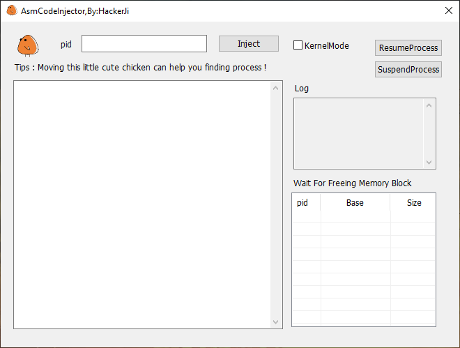

    

<h1>Asm Injector</h1>
[简体中文](README-zh.md) | [English](README.md) 

## interface
     
## Build environment
- VisualStudio2019 16.11.17
- MFC v142

## Support Features
- x64 & x86 process inject
- Moving icon get process id
- Free shellcode memory
- English interface & Chinese interface

## Coming Features
- KernelMode
